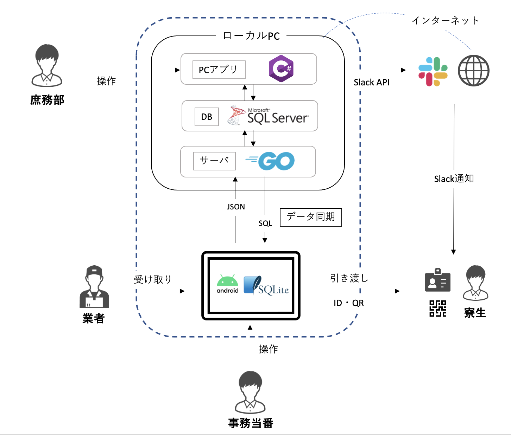

# 熊野寮荷物アプリ POKKE - Android

熊野寮事務室に届く荷物の受け取り・引き渡し・管理を行うための、事務当番用の Android アプリです。登録・修正されたデータは[POKKE サーバーサイド](https://github.com/kumano-jimushitsu/luggage-manager-api)に送信され、同期・バックアップされます。

## アーキテクチャ

  

## 操作概要

  

メイン画面から各ページに移り、操作を行います。
主な操作は以下の通りです：

- 事務当番交代
- 業者からの荷物受け取り
- 寮生への荷物引き渡し
- 泊まり事務当番時の荷物確認

## 各画面について

### メイン画面

  

各種操作画面へ移るボタンが配置されています。画面右の履歴一覧から、行なった操作の閲覧・削除ができます。

### 事務当番交代画面

  

事務当番に入ったら、自分の名前を検索して事務当番に設定します。

### 荷物受け渡し画面

  
  

業者から荷物が運ばれてきたら、種別選択ダイアログで荷物の種別（普通・冷蔵・冷凍・大型・不在票・その他）を選んでから、持ち主の名前を登録します。種別が「その他」の場合、200 字以内で説明を書いてください。

### 荷物引き渡し画面

  
  
  

寮生が荷物を取りにきたら、寮生の名前を選択して荷物を引き渡します。代理人に対して荷物受け取りを行う場合、画面右下の「代理引き渡し」をオンにして、代理人の名前を選択して引き渡しします。

### 泊まり事務当番画面

  
  

泊まり事務当番に入ったら、① 荷物棚の荷物と POKKE 内のデータが一致しているかどうかをチェックした後、② 荷物札が存在するかどうかチェックします。

## Slack との連携

Slack の POKKE ワークスペースに入ると、荷物が届いた時に Slack で通知を受けることができます。また、通知と一緒に荷物引き渡し用の QR コードも送られてきます。メイン画面の QR 受け取りボタンから読み取ると、自動で引き渡しを行うことができます。

## 関連リンク

- POKKE サーバーサイド（同期用）：https://github.com/kumano-jimushitsu/luggage-manager-api
- POKKE PC アプリ（庶務部管理用）：https://github.com/kumano-jimushitsu/nimotsu-app-pc
